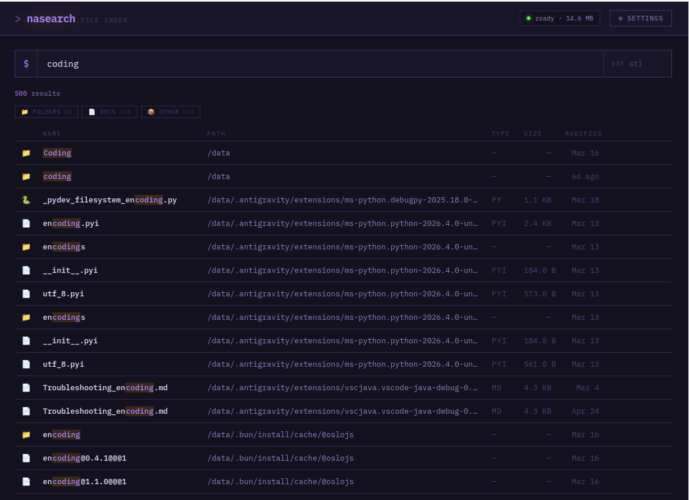

# NASearch

[](https://github.com/dewgenenny/nasearch/actions/workflows/docker-publish.yml)
[](https://github.com/dewgenenny/nasearch/pkgs/container/nasearch)

Lightweight file search for self-hosted storage. FastAPI + plocate, no Elasticsearch, no Node, no build step.

Point it at your array, let it index, then search from a browser.



## Features

- **Fast search** — plocate pre-built index returns results in milliseconds regardless of array size; filter by extension, sort by name/size/modified, filter by file type
- **File previews** — click any result to open an in-browser preview: images, video (with seeking), audio, PDF, Markdown (rendered + sanitised), plain text and code, ZIP contents
- **Folder browser** — navigate into any directory from the preview panel; breadcrumb navigation; download any folder as a streaming ZIP
- **Infinite scroll** — results load in batches; no pagination
- **Re-index schedule** — configurable interval (manual, 1h, 6h, 12h, 24h, 48h, weekly) with live status indicator in the header
- **Multiple themes** — Dark, Light, Purple, Slate
- **Auth** — session cookie login with CSRF protection and login rate limiting; or opt out explicitly with `NOAUTH=true`

---

## Why not just use `find`?

The shell has excellent tools for this — `find`, `locate`, `fd` — and if you're comfortable in a terminal they're great. NASearch is for a different situation: searching a large NAS from a browser, sharing access with people who aren't comfortable on the command line, or quickly previewing a file without downloading it first.

The bigger practical issue with `find /mnt/user | grep something` on a large array is speed. `find` traverses the filesystem in real time, touching every directory on every disk. On an array with millions of files across spinning drives that can take several minutes. NASearch uses `plocate`, which pre-builds a compressed index — searches return in milliseconds regardless of array size. The trade-off is a small staleness window between index runs, handled by the configurable schedule and the manual re-index button.

---

## Install

### Unraid — Community Applications

Search for **NASearch** in the Community Applications store and install directly from there. All config fields (port, paths, auth) are exposed in the Unraid template UI.

### Docker Compose

Create a directory and a `docker-compose.yml`:

```yaml
services:
  nasearch:
    image: ghcr.io/dewgenenny/nasearch:latest
    container_name: nasearch
    restart: unless-stopped
    ports:
      - "8000:8000"
    volumes:
      - /mnt/user:/data:ro   # your array, read-only
      - ./index:/index        # index DB + settings.json
    environment:
      - LOCATE_DB=/index/files.db
      - DATA_PATH=/data
      - PRUNE_PATHS=/data/appdata /data/system /data/domains /data/isos
      - MAX_RESULTS=500

      # ── Auth (choose one) ────────────────────────────────────────
      # NASearch will refuse to start until you pick an option.
      #
      # Option A — Session auth (recommended):
      # - AUTH_USER=admin
      # - AUTH_PASS=your-strong-password-here
      #
      # Option B — No auth (acknowledged risk):
      # - NOAUTH=true
```

Then start it:

```bash
docker compose up -d
```

The container builds the initial index on first start (a few minutes depending on array size). Browse to **http://your-server:8000**.

### Updating

```bash
docker compose pull && docker compose up -d
```

---

## Configure volumes

**Single volume** (simplest — everything under one mount):

```yaml
volumes:
  - /mnt/user:/data:ro
  - ./index:/index
```

**Multiple volumes** — mount each source as a named subdirectory under `/data`:

```yaml
volumes:
  - /mnt/user:/data/nas:ro
  - /media/external:/data/external:ro
  - /home:/data/home:ro
  - ./index:/index
```

NASearch indexes the entire `/data` tree, so all sources appear in results. Paths show the full mount path (e.g. `/data/nas/movies/...`, `/data/external/photos/...`), making it clear which volume a file lives on.

Exclude noisy subdirectories with `PRUNE_PATHS` — see [Configuration](#configuration).

---

## Security

NASearch runs as root inside the container and can serve any file under `/data`. That's an intentional trade-off — see [Why root?](#why-the-container-runs-as-root) below. Because of this, the app **refuses to start** unless you have explicitly acknowledged the auth situation.

### Session auth

Set both variables in your compose file:

```yaml
environment:
  - AUTH_USER=admin
  - AUTH_PASS=your-strong-password-here
```

- Credentials are submitted once via a login form and validated with a constant-time compare (timing-attack resistant)
- A `httpOnly`, `SameSite=lax` session cookie is issued on success (24-hour lifetime by default, configurable with `SESSION_HOURS`)
- A per-session CSRF token is validated on all state-changing requests
- Login is rate-limited: 5 failed attempts within 15 minutes locks the IP out for 15 minutes
- CDN scripts (marked.js, DOMPurify) are loaded with Subresource Integrity hashes — the browser refuses to execute them if the content doesn't match
- A Content-Security-Policy restricts where the UI may load scripts, styles and data from
- Files from the array are treated as untrusted: HTML/XML is never served inline with an executable MIME type, and inline previews carry a `Content-Security-Policy: sandbox` header so a malicious file on the NAS can't run scripts on NASearch's origin
- If you serve NASearch over HTTPS, set `COOKIE_SECURE=true` so the session cookie is never sent over plain HTTP

### Use HTTPS — and think carefully before exposing it at all

Without TLS, the login POST is cleartext on the wire. If you expose NASearch outside your local network you **must put it behind a TLS-terminating reverse proxy**. [Nginx Proxy Manager](https://nginxproxymanager.com/) and [Caddy](https://caddyserver.com/) are popular options.

That said, the strong recommendation is **don't expose it to the internet at all**. NASearch is a root-running process that can read and serve every file on your array. If you need remote access, a VPN (Tailscale, WireGuard) is a much safer boundary.

### Why the container runs as root

`updatedb` needs to crawl the entire directory tree — including paths owned by other users, Docker btrfs subvolumes, and system directories — to build a complete index. A restricted user silently misses anything it can't `stat`, defeating the point of the tool.

The actual risk surface is kept small by other means:

- All source volumes are mounted **read-only** — the process can never modify your files
- All file-serving paths are validated against `DATA_PATH` to prevent directory traversal
- Session auth with CSRF protection gates the entire UI when credentials are configured
- Docker's own namespace and cgroup isolation still applies

---

## Configuration

| Variable | Default | Purpose |
|---|---|---|
| `AUTH_USER` | _(unset)_ | Login username; both must be set to enable auth |
| `AUTH_PASS` | _(unset)_ | Login password |
| `SESSION_HOURS` | `24` | Session cookie lifetime in hours |
| `COOKIE_SECURE` | `false` | Set `true` when serving over HTTPS (e.g. behind a TLS reverse proxy) to add the `Secure` flag to the session cookie |
| `NOAUTH` | `false` | Set `true` to start without auth (acknowledged risk) |
| `DATA_PATH` | `/data` | Root path that is indexed and served |
| `LOCATE_DB` | `/index/files.db` | Path to the plocate database |
| `PRUNE_PATHS` | See compose file | Space-separated absolute paths to skip during indexing |
| `MAX_RESULTS` | `500` | Cap on results returned per search |
| `ZIP_MAX_FILES` | `2000` | Max files allowed in a folder zip download |
| `ZIP_MAX_BYTES` | `2147483648` | Max uncompressed size of a folder zip (2 GB) |

### Excluding paths from the index

Set `PRUNE_PATHS` as a space-separated list of absolute paths:

```yaml
environment:
  - PRUNE_PATHS=/data/nas/appdata /data/nas/system /data/nas/isos
```

Useful for high-churn directories (Docker appdata, VM images) that would otherwise bloat the index.

### Homepage dashboard integration

NASearch exposes a JSON widget endpoint compatible with [Homepage](https://gethomepage.dev). Uncomment and fill in the labels section of your compose file:

```yaml
labels:
  - homepage.name=NASearch
  - homepage.group=Tools
  - homepage.href=http://192.168.1.10:8000
  - homepage.icon=si-files
  - homepage.widget.type=nasearch
  - homepage.widget.url=http://192.168.1.10:8000
```
